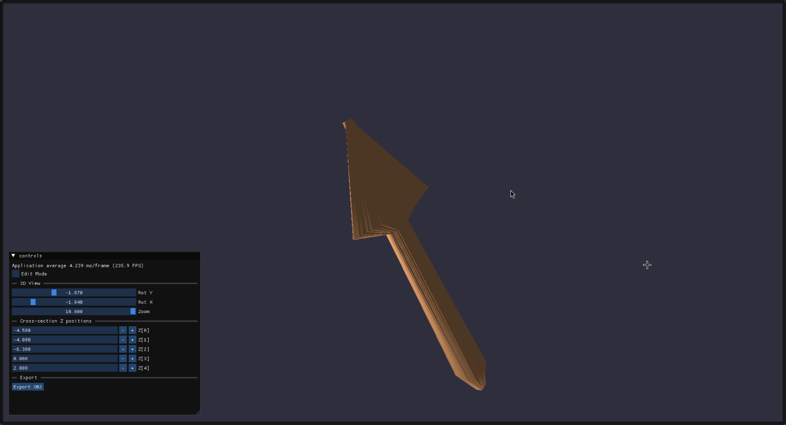
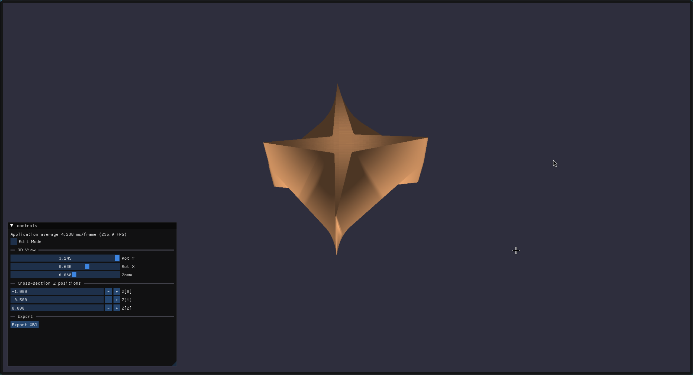

# Experimental Cross-Section Based 3D Modeling

Draw 2D freeform cross-sections, arrange them along Z, and generate a closed 3D mesh with Phong shading. Export to OBJ for use in other tools.




## Screenshots

| In-app 3D view | Same model in Blender | OBJ export dialog |
|---|---|---|
|  |  |  |

## Features

- **Draw & stack** — sketch closed 2D shapes, save each as a cross-section, then arrange them at arbitrary Z depths.
- **Auto mesh** — cross-sections are resampled to uniform point counts, connected into a triangulated surface with top/bottom caps, and rendered with Phong lighting.
- **Orbit & inspect** — drag to rotate the model, scroll to zoom. Per-keyframe Z sliders let you tweak the spacing.
- **OBJ export** — writes vertex positions, normals, and triangular face indices for import into Blender, Maya, etc.
- **Ghost overlay** — the previously saved frame appears as a faint guide while drawing the next one, helping you align shapes.
- **OpenGL ES 3.0** — runs on a lightweight ES profile context with GLFW + ImGui.

## Build

```bash
mkdir build && cd build && cmake .. && make
```

Or use `./run.sh`. The binary `teddyimpl` is placed in the repo root.

**System dependencies:** OpenGL dev libraries (`libglfw3-dev`, `libopengl-dev`, or distro equivalents). GLM, GLAD, ImGui, and ImGuiFileDialog are fetched automatically via CMake `FetchContent`.

## Run

Must run from the **repo root** — shader paths are hardcoded as `../src/shaders/` relative to CWD.

```bash
./teddyimpl
```

## Controls

| Action | Input |
|---|---|
| Draw | Left-click drag in edit mode |
| Erase last point | Right-click |
| Clear canvas | Tab |
| Orbit model | Left-click drag in view mode |
| Zoom | Scroll wheel in view mode |
| Quit | Escape |

## How it works

**Edit mode** (default on launch): draw a closed 2D freeform shape on the canvas. Click "Save Frame" to push it onto the keyframe stack — a new blank canvas appears on top for the next cross-section.

**View mode** (uncheck "Edit Mode"): all keyframes are resampled to equal point counts, sorted by Z, and connected into a triangulated surface mesh with top/bottom caps. The mesh is rendered with Phong shading (ambient + diffuse + specular) using an overhead light source.

Each saved frame has an adjustable Z slider, so you can freely arrange cross-sections along the extrusion axis.

## Credits

Inspired by the **Teddy** sketch-based modeling system (Igarashi et al., SIGGRAPH 1999).
